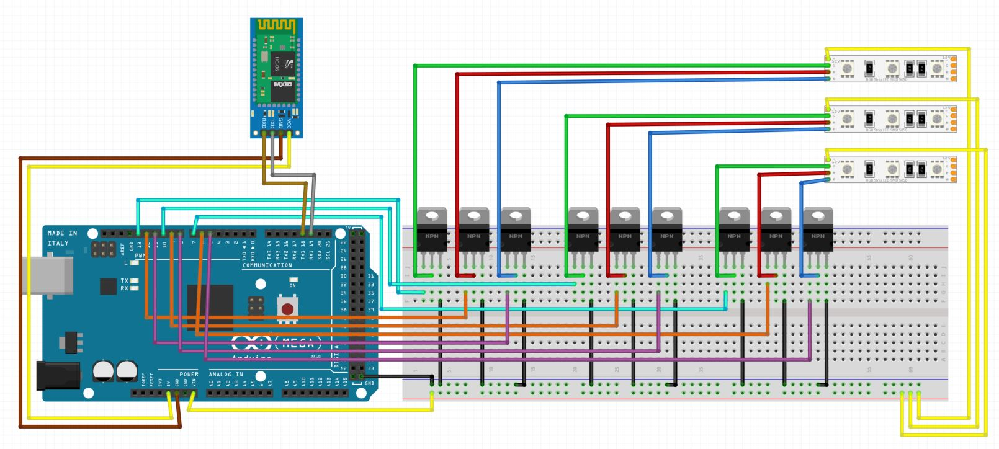
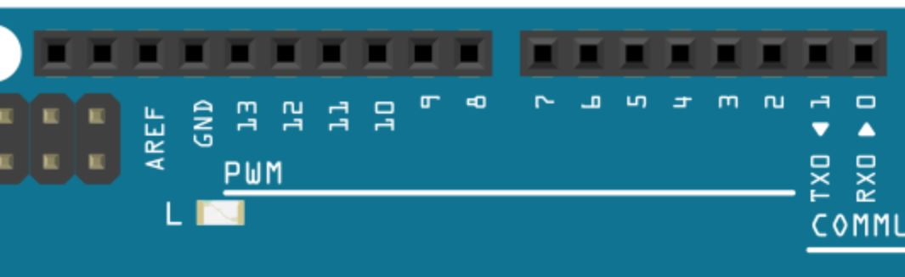
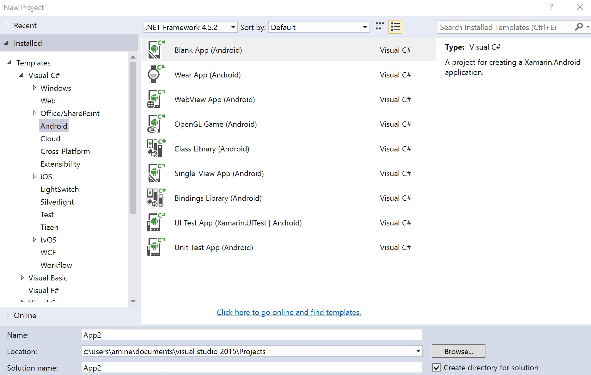
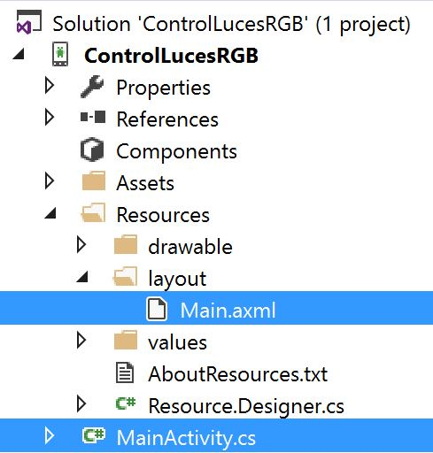
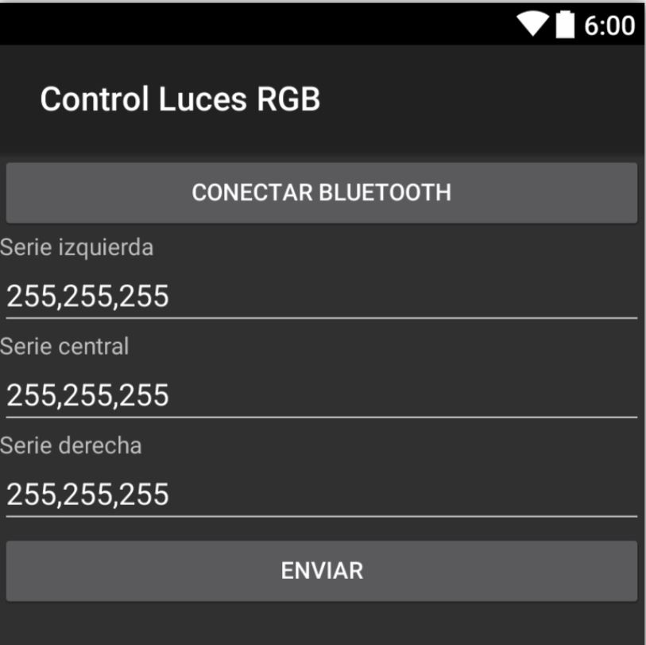

## Escritorio con luces RGB controladas desde Bluetooth ##

Este proyecto lo hice con una sola intención probar conceptos que había visto pero que no había usado y menos aún, no los había usado en conjunto así que creo que es un buen proyecto por el conjunto de características que usa para nivel intermedio.

# El hardware requerido

La lista de Hardware que necesitas es la siguiente:

1. Un [Arduino Mega](https://www.330ohms.com/products/arduino-mega-2560-r3)
2. Un módulo [HC-06](https://www.330ohms.com/products/bluetooth-hc-06-esclavo)
3. Tres tiras de led RGB análogas
4. Nueve transistores [TIP120](https://www.330ohms.com/products/tip120) (tres por cada tira de leds que vayas a utilizar)
5. Una tarjeta de prototipado y ¡muchos cables!

# Ensamblado

Para armar tu prototipo, lo que debes hacer es seguir el siguiente diagrama (Hecho con [Fritzing](http://fritzing.org/home/)).



Creo que el diagrama es sumamente explícito pero en caso de que tengas alguna duda solo levanta un issue con tu duda y la aclararé tan pronto como pueda.

# El código de Arduino

Hay algo curioso al utilizar un sensor de Bluetooth desde el Arduino Mega. A diferencia de muchos modelos de Arduino, el Mega cuenta con múltiples puertos seriales así que no es necesario que agregues ninguna biblioteca de clases adicional sino que únicamente utilices un serial diferente del que estás acostumbrado a usar en la terminal.

```c
String infoRecibida = "";

void setup() 
{
  Serial1.begin(9600);
  Serial1.println("Conexión lista");
  Serial.begin(19200);
}

void loop() 
{
  while (Serial1.available()>0)
    {
        char character = Serial1.read(); 
        infoRecibida.concat(character);
        if (character == ':')
        {
            //lógica del código ejecutada con el resultado recibido del Bluetooth
			infoRecibida = "";
        }
  }
}
```

Por el lado de los leds, para que puedas aumentar y atenuar la luz a tu voluntad debes apoyarte en los pines de tu Arduino que cuenten con señal PWM. Debes usar un pin por cada color, esa es la razón por la que se justifica el uso de un Arduino Mega y no otro modelo, solo esta versión viene con los suficientes pines para todas las tiras LED (en total para este proyecto necesitas 9 pines con PWM).



Una vez que tengas todo conectado, el código final del proyecto se encuentra en la carpeta [Arduino](enlace de la carpeta).

# El proyecto de control desde Arduino

Por lo fan que soy de C# y Visual Studio, intento encontrar la solución a todos mis problemas desde este lenguaje de programación y en este caso el aprovecharme de la ventaja que me ofrece [Xamarin](https://www.xamarin.com/) para crear aplicaciones de Android. Así que lo que hice fue crear un proyecto en Visual Studio utilizando Xamarin para Android.



En el proyecto, debes fijarte en dos archivos principalmente. Main,axml y MainActivity.cs



El primer archivo mencionado, Main.axml es el encargado de construir la interfaz de la aplicación y el resultado final es el siguiente.



En el archivo MainActivity.cs se encuentra la lógica de la aplicación. Los métodos de conexión Bluetooth y su vinculación con la interfaz de la aplicación. 

Disfruta el proyecto, mejora lo que tienes ahora en las manos y cuéntame que mejoras le harás. ¡Es más, realiza un branch y vuélvete contribuidor del proyecto!
